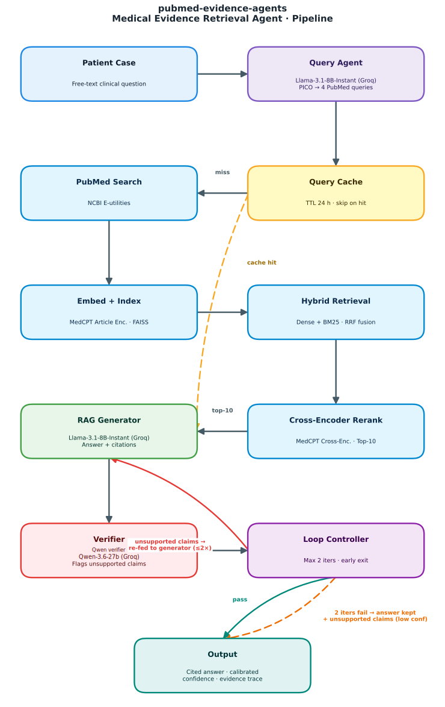

# pubmed-evidence-agents

Medical Evidence Retrieval Agent for clinical questions. The app extracts a PICO query from a free-text case, retrieves PubMed evidence with hybrid MedCPT and BM25 search, reranks evidence with a MedCPT cross-encoder, generates a cited answer, and verifies the answer against retrieved source passages.

## Demo

<video src="web/public/pubmed-evidence-agents-demo.mp4" controls width="100%">
  <a href="web/public/pubmed-evidence-agents-demo.mp4">Watch the demo video</a>
</video>

## Pipeline



## What is included

- FastAPI backend in `pubmed-evidence-agents/`
- Next.js frontend in `web/`
- PubMed retrieval, reciprocal-rank fusion, cross-encoder reranking, answer generation, verification, confidence scoring, and cache support
- GitHub Actions CI for backend smoke tests and frontend production builds
- Demo video for the GitHub README at `web/public/pubmed-evidence-agents-demo.mp4`
- Pipeline SVG for the GitHub README at `web/public/pipeline-diagram.svg`

## Prerequisites

- Python 3.12
- Node.js 18+ (Node 22 recommended)
- A Groq API key for the default `DEPLOY_MODE=groq`
- Optional NCBI API key for higher PubMed rate limits

The first backend run downloads MedCPT models from Hugging Face. Expect roughly 1.3 GB of model downloads for the query encoder, article encoder, and cross-encoder.

## Quick Start

Start the backend:

```bash
cd pubmed-evidence-agents
python -m pip install -r requirements.txt
cp .env.example .env
uvicorn main:app --host 0.0.0.0 --port 8015
```

Set at least this value in `pubmed-evidence-agents/.env`:

```bash
GROQ_API_KEY=your_key_here
```

Start the frontend in a second terminal:

```bash
cd web
npm install
cp .env.local.example .env.local
npm run dev
```

Open `http://localhost:3000`.

## Environment

Backend configuration lives in `pubmed-evidence-agents/.env`.

| Variable | Purpose |
| --- | --- |
| `DEPLOY_MODE` | `groq`, `hf`, `together`, or `local`; defaults to `groq` |
| `GROQ_API_KEY` | Required for the default Groq mode |
| `HF_TOKEN` | Required for Hugging Face inference mode |
| `TOGETHER_API_KEY` | Required for Together mode and optional vision analysis |
| `NCBI_API_KEY` | Optional key for higher PubMed API limits |
| `USE_BM25` | Set to `0` to disable BM25 lexical retrieval |
| `USE_CROSS_ENCODER` | Set to `0` to disable second-stage reranking |

Frontend configuration lives in `web/.env.local`.

| Variable | Purpose |
| --- | --- |
| `PUBMED_EVIDENCE_AGENTS_API_URL` | FastAPI backend URL used by Next.js proxy routes |

## Tests

Backend offline tests:

```bash
cd pubmed-evidence-agents
python -m pytest tests/test_preprocessor.py tests/test_cache.py -v
```

Backend tests excluding live integrations:

```bash
cd pubmed-evidence-agents
python -m pytest -m "not integration"
```

Frontend production build:

```bash
cd web
npm run build
```

## Project Layout

```text
pubmed-evidence-agents/    FastAPI backend and retrieval/generation pipeline
web/                       Next.js frontend and API proxy routes
web/public/                Public frontend assets, including pipeline-diagram.svg
.github/workflows/ci.yml   Backend and frontend CI
PRD.md                     Product requirements
PLAN.md                    Build plan
UI_PLAN.md                 Frontend plan
```

## Preparing a GitHub Push

This folder is ready to become the repository root.

```bash
git init
git add .
git commit -m "Initial pubmed evidence agent"
git branch -M main
git remote add origin https://github.com/<your-username>/<your-repo>.git
git push -u origin main
```

Secrets are intentionally ignored by `.gitignore`. Do not commit `.env`, `.env.local`, local model caches, logs, `.next/`, or `node_modules/`.

## Notes

The generated evidence is for research and education support only. It is not a substitute for clinical judgement.
